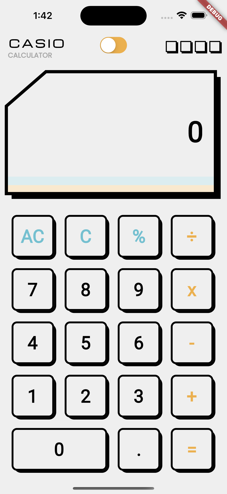
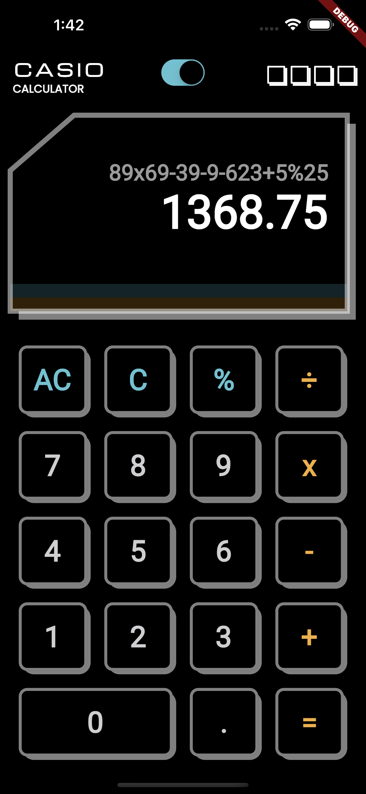
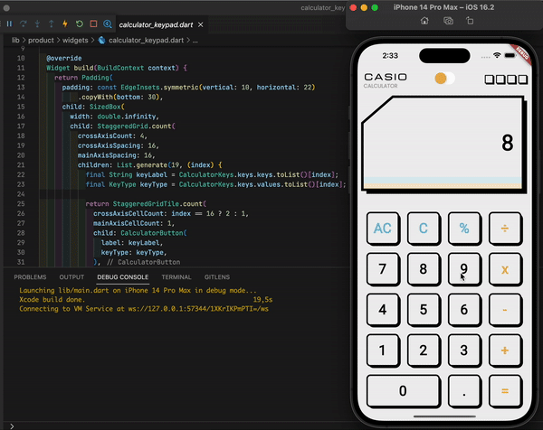

# Casio Calculator App
> Flutter mobile application of the vintage Casio calculator

<details>
<summary>Table of Contents</summary>

* [General Info](#general-information)
* [Technologies Used](#technologies-used)
* [Features](#features)
* [Screenshots](#screenshots)
* [Preview](#preview)
* [Setup](#setup)
* [Usage](#usage)
* [Project Status](#project-status)
* [Room for Improvement](#room-for-improvement)
* [Acknowledgements](#acknowledgements)
* [Contact](#contact)
* [License](#license)
</details>

<br>

## General Information
- It is a calculator simulator app that you can use in your daily life
- The project was made with [**Flutter**](https://flutter.dev) framework and [**Dart**](https://dart.dev) language
- State management of app made with the help of [**Provider**](https://pub.dev/packages/provider) package 


## Technologies Used
- Flutter - version 3.3.10
- Dart - version 2.18.6
- CocoaPods - version 1.11.3
- Android Studio - version 2021.3
- VS Code - version 1.74.3


## Features
- You can experience using classic Casio calculator
- Has the features of a standard calculator
- Light and dark theme


## Screenshots
Light Theme             |  Dark Theme
:-------------------------:|:-------------------------:
 | 

## Preview



## Setup
You can clone this repository and run it on an android or ios simulator immediately

To clone this repo;

```
git clone https://github.com/recepsenoglu/flutter_calculator.git
```

## Usage
Do some calculations and try changing the theme


## Project Status
Project is: _complete_


## Room for Improvement
Feel free to contribute to this project

Room for improvement:
- Button click animations
- Display screen label change animations


## Acknowledgements
- This project's UI design was inspired by [Shubham Singh](https://www.patreon.com/shubham_iosdev)
- You can view the figma UI design of project that I created by clicking [this link](https://www.figma.com/file/OlzlBexszTvdMqKbgHXiW4/Casio-Calculator-Design?node-id=0%3A1&t=dgzvIzmJdDW1drqZ-1)

## Contact
Created by [@recepsenoglu](https://github.com/recepsenoglu) - feel free to contact me!

## License
This project is open source and available under the [MIT License](https://github.com/recepsenoglu/flutter_calculator/blob/main/LICENSE).
